# A second look at LetsVPN Apps from Third-party and non-App store locations

## Key Findings

* Investigated 8 LetsVPN clones

* Two of the APKs are msi files, two are "exe" files, and the remaining are APKs files

* One APK, Candidate6, uses obfuscation (shared/imported libraries still contain social network of Code)

## Motivation 

LetsVPN is an app focused primarily on Chinese users. [Crybl](https://cyble.com/blog/new-malware-campaign-targets-letsvpn-users/) 
documented attacks targeting LetsVPN to install malware on the user's device. The legitimate LetsVPN App is developed by LetsGo Networks 
and is focused on Chinese users. According to [AppleCensorship](https://applecensorship.com/app-store-monitor/test/letsvpn) LetsVPN is
also removed from the Chinese App store. The goal of this work is to collect as much information about the systems and resourced obvious imposter VPNs use to support the effort of fooling targets. This involves first identifying active operations, collecting and cross-referencing web pages, domain names, names, email addresses, phone numbers. 

One means by which an attacker tricks a target into installing malware onto their device is through typo-squatting. For LetsVPN, the attacker will create variations of LetsVPN's domain name. This is the method previously used by Cyble to discover imposters and is the method adopted for this threat-hunting exercise. Another method to achieve this is by serving download links for illegitimate software.

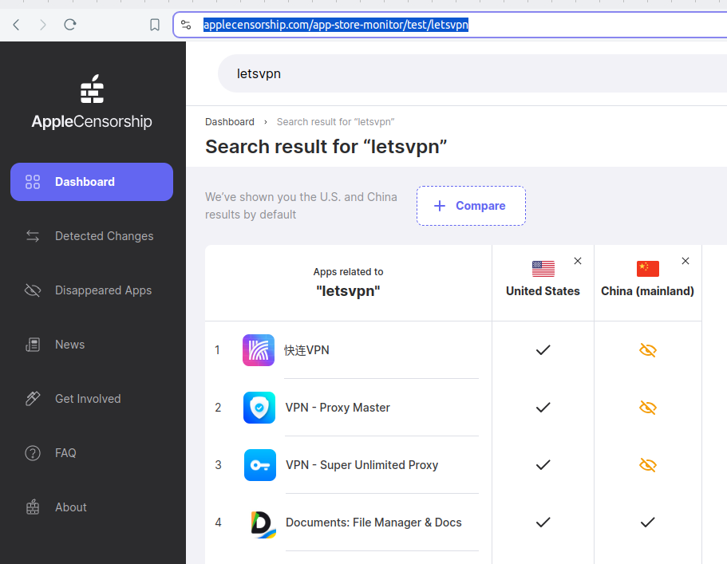

This makes it an appealing target for impersonation.

[
  {"domain" : "letsvpn.world", 
   "fake" : false,
   "webpage" : {
    "Names" : "LetsVPN",
    "privacy policy" : "https://letsvpn.world/privacy",
    "Company names" : ["LetsGo Networks"]
    "emails": [
      "letsvpn@rbox.me"
    ],
    "hrefs": [
      "/help/appstore",
      "/promoters",
      "/blogs",
      "",
      "/privacy",
      "/terms",
      "/registerterm"
    ],
    "urls": [
      "https://www.adwtrue.xyz/windows/letsvpn-latest.exe",
      "https://www.adwtrue.xyz/android/letsvpn-latest.apk",
      "https://www.adwtrue.xyz/mac/letsvpn-latest.dmg"
    ],
    "social_media": [
      "https://twitter.com/letsvpn",
      "https://www.instagram.com/letsvpn/"
    ],
    "languages": [
      "Simplified Chinese",
      "English",
      "Traditional Chinese",
      "Russian"
    ]
  },
  "whois" : {
    "Updated Date": "2024-05-20T06:21:10Z"
    "Creation Date": "2017-07-27T19:18:20Z"
    "Registrar" : {
       "Registrar WHOIS Server": "whois.namecheap.com"
       "Registrar URL": "https://www.namecheap.com/"
    },
    "Registrant" : ["redacted" : true],
    "Admin": ["redacted" : true],
    "Tech" : ["redacted" : true],
    "Name Server": "ns-859.awsdns-43.net",
    "Name Server": "ns-2015.awsdns-59.co.uk", 
    "Name Server": "ns-1355.awsdns-41.org",
    "Name Server": "ns-354.awsdns-44.com",
    "DNSSEC": "unsigned"
  },
  "dig" : {
    "ips" : {
      18.238.109.68 : {"whois" : "Amazon Technologies Inc."},
      18.238.109.5 : {"whois" : "Amazon Technologies Inc."},
      18.238.109.48 : {"whois" : "Amazon Technologies Inc."},
      18.238.109.112 : {"whois" : "Amazon Technologies Inc."}
    }
  },
  "social_media" : [
    "twitter" : ["website" : "letsvpn.world", "location" : "Canada", "Following" : 76, "Followers" : "40.1K"]
    "instagram" :  [],
    "telegram" : [],
  ],
  "google trends" : [
    "12 months" : ["world wide" : []]
  ],
  "open corporates" : ["LetsGO Network Incorporated" : {
    "business identifier" : ,
    "business country" : "Canada"
    "registered office" : "675 Cochrane Dr, East Tower, Suite 600, MARKHAM ON L3R 0B8, Canada",
    "status" : "active",
    "Corporation Number" : "1104533-4",
    "Business Number (BN)": "730435880RC0001",
    "governing legislation": "Canada Business Corporations Act - 2018-10-16",
    "Director" : {"Hong Lei" : { "address" : "675 Cochrane Dr East Tower, Suite 600, Markham ON L3R 0B8, Canada"}
  }]},
  "google play" : {
    "app support" : {
      "website" : "https://letsvpn.world/",
      "phone number" : "+16695000327",
      "email address" : "letsvpn@rbox.me",
      "address" : "1245 Bowman Dr, Oakville, ON L6M 3J5, Canada",
      "privacy policy" : "https://letsvpn.world/privacy"
    },
    "Updated on" : "Aug 23, 2024",
    "reviews" : "68.2k",
    "stars" : "4.4"
  },
  "github" : {}
}, 
  {"domain" : "letsssvpn.com",
   "fake" : true, 
   "website" : {
     "privacy policy" : "error",
     "terms of service" : "error",
     "meta": {
       "canonical": "/",
    "twitter_card": "summary_large_image",
    "twitter_creator": "@trustwalletapp",
    "og_locale": "zh_CN",
    "og_type": "website",
    "og_url": "",
    "og_site_name": "VPN",
    "al_ios_url": "trust://",
    "theme_color": "#3375BB"
  },
  "scripts": [
    "/js/plausible.js",
    "/js/platform.js",
    "//sdk.51.la/js-sdk-pro.min.js"
  ],
  "links": {
    "canonical": "/",
    "favicon": "./favicon_fly.ico",
    "stylesheet": "/css/main.css",
    "alternate": {
      "href": "",
      "hreflang": "en"
    }
  },
  "images": [
    "/images/logo_word_zh.7d8620d0.png",
    "/images/ietel.png",
    "/images/home_introduce_1.4974b5ba.png",
    "/images/home_introduce_2.8e9af5ce.png",
    "/images/home_introduce_4.82a6475d.png",
    "/images/home_introduce_5.8e475357.png",
    "/images/home_security.png",
    "/images/3steps.png",
    "/images/3steps2.png",
    "/images/3steps3.png",
    "/images/logo_footer_zh.f421f1d9.png",
    "/images/lest-test.3.1.2.zip.png"
  ],
  "urls": [
    "https://web.dcobxs.com/matomo.php",
    "https://web.dcobxs.com/matomo.js",
    "https://letsvpn.win/terms/",
    "https://letsvpn.win/privacy/"
  ],
  "downloads": [
    "/lest-test.3.1.2.zip"
  ],
  "social_media": [
    "https://twitter.com/trustwalletapp"
  ],
  "languages": [
    "Simplified Chinese",
    "English"
  ],
  "host" : "Hong Kong"
  },
  "whois" : {
     "Updated Date" : 2024-07-11T07:30:57Z,
     "Creation Date" : 2024-07-11T07:30:58Z,
     "Registrar" : {
       "Registrar WHOIS Server" : "whois.webnic.cc",
       "Registrar URL" : "http://www.webnic.cc",
       "Registrar Abuse Contact Email" : compliance_abuse@webnic.cc",
       "Registrar Abuse Contact Phone" : +60.389966799 
     }, 
     "Registrant" : {
	"Registry Registrant ID: Not Available From Registry
	"Registrant Name: wangyiyi wangyiyi
	"Registrant Organization: wangyiyi
	"Registrant Street: wangyiyi 
	"Registrant City: wangyiyi
	"Registrant State/Province: wangyiyi
	"Registrant Postal Code: 000000
	"Registrant Country: HK
	"Registrant Phone: +852.65820038
	"Registrant Phone Ext: 
	"Registrant Fax: +0.0
	"Registrant Fax Ext: 
	"Registrant Email: qingqing7896@outlook.com
     },
     "Admin" : {
	Admin Name: wangyiyi wangyiyi
	Admin Organization: wangyiyi
	Admin Street: wangyiyi 
	Admin City: wangyiyi
	Admin State/Province: wangyiyi
	Admin Postal Code: 000000
	Admin Country: HK
	Admin Phone: +852.65820038
	Admin Phone Ext: 
	Admin Fax: +0.0
	Admin Fax Ext: 
	Admin Email: qingqing7896@outlook.com
     },
     "Tech" : {
	Registry Tech ID: Not Available From Registry
	Tech Name: wangyiyi wangyiyi
	Tech Organization: wangyiyi
	Tech Street: wangyiyi 
	Tech City: wangyiyi
	Tech State/Province: wangyiyi
	Tech Postal Code: 000000
	Tech Country: HK
	Tech Phone: +852.65820038
	Tech Phone Ext: 
	Tech Fax: +0.0
	Tech Fax Ext: 
	Tech Email: qingqing7896@outlook.com
     },
     "Name Server": "NS1.HNDNSV1.COM",
     "Name Server": "NS2.HNDNSV1.COM",
     "DNSSEC": unsigned",
     "ips" : { "47.238.108.228" : {"whois" : Alibaba Cloud LLC"}}
   },
   "dig": {"A": "47.238.108.228"},
   "social media": {}
   "google trends" : {},
   "google play" : {}
   "application" : {
     "windows" : {
       "installer" : "", 
       "sha256" : 775be68acb1cf0925f1427d464cc9bf17f8c906d44a068eb23815ab9842689e7,
       "virus-total" : {
         "meta" {"number scanners" : 59, "number hits" : 20},
         "relations" : {
           "Contracted URLs" : [{"url" : "http://143.92.49.135:15888", "scan date" : "2024-06-21", "detections" : 0}]
           "bundled files" : [{ "scan date" : "2024-07-29 11:13:46 UTC", "detections" : "47 / 74", "file type" : "Win32 DLL",
                                "file name":  "Comn.dll"},
                              {"scan date" : "2024-07-13", "detections" : "20 / 63", "file type" : "CAB", "name" : "disk1.cab"}],
           }
         }
       }
    },
    "open corporates" : {},
    "github" : {}
   }
  },
  {"domain" : "lettsvpn.com",
   "fake" : true, 
   "website" : {
      "names" : "LetsVPN",
      "privacy policy" : ,
      "" : [""],
      "emails" : [],
      "downloads" : {
        "android" : { "url": "https://ha.fanshu8.net/down.html",
          "files" : [
            {"name" :"KLvvppnn.3.1.2.zip",
             "sha256" : "e45718ab8bf0c49942a204ee8278d4d87f6a8f4c5ca24da8f4e376a05b478914",
              "virus-total" : {}},
            {"name" : "leuxs-lix.msi",
             "sha256" : "e60a30270b3d25461b02154f5435c67bce81d6ad8063e3d074acea999f933136",
             "virus-total" : {}}],
        "windows" : "https://ha.fanshu8.net/down.html"
      }
    }
   },
   "whois" : {
     "Updated Date": "2024-05-14T23:13:21Z",
     "Creation Date": "2024-05-14T23:13:20Z",
     "Domain Status": "clientTransferProhibited https://icann.org/epp#clientTransferProhibited",
     "Name Server": "NS1.HNDNSV1.COM",
     "Name Server": "NS2.HNDNSV1.COM",
     "DNSSEC": "unsigned"

     "registrar" : {
       "Registrar URL": "http://www.matbao.net",
       "Registry Expiry Date": "2025-05-14T23:13:20Z",
       "Registrar": "MAT BAO CORPORATION",
       "Registrar IANA ID": "1586",
       "Registrar Abuse Contact Email": "abuse@matbao.com",
       "Registrar Abuse Contact Phone": "+84-36229999 - 8899",
     },
     "registrant" : {
        "Registrant Name": "Domain Admin",
	"Registrant Organization": "Whoisprotection.cc",
	"Registrant Street: Lot 2-1, Incubator 1, Technology Park Malaysia, Bukit Jalil",
	"Registrant City": "Kuala Lumpur",
	"Registrant State/Province": "Wilayah Persekutuan",
	"Registrant Postal Code": "57000",
	"Registrant Country": "MY",
	"Registrant Phone": "+60.389966788",
	"Registrant Phone Ext": "",
	"Registrant Fax": "+60.389966788",
	"Registrant Fax Ext": "",
	"Registrant Email": "compliance_abuse@webnic.cc",
     },
     "admin" : {
	"Admin Name": "Domain Admin",
	"Admin Organization": "Whoisprotection.cc",
	"Admin Street": "Lot 2-1, Incubator 1, Technology Park Malaysia, Bukit Jalil",
	"Admin City": "Kuala Lumpur",
	"Admin State/Province": "Wilayah Persekutuan",
	"Admin Postal Code": 57000",
	"Admin Country": "MY",
	"Admin Phone": "+60.389966788",
	"Admin Phone Ext": "",
	"Admin Fax": "+60.389966788",
	"Admin Fax Ext": "",
	"Admin Email": "compliance_abuse@webnic.cc",
     },
     "tech" : {
	"Tech Name": "Domain Admin",
	"Tech Organization": "Whoisprotection.cc",
	"Tech Street": "Lot 2-1, Incubator 1, Technology Park Malaysia, Bukit Jalil",
	"Tech City": "Kuala Lumpur",
	"Tech State/Province": "Wilayah Persekutuan",
	"Tech Postal Code": "57000",
	"Tech Country": "MY",
	"Tech Phone": "+60.389966788",
	"Tech Phone Ext": "",
	"Tech Fax": "+60.389966788",
	"Tech Fax Ext": "",
	"Tech Email": "compliance_abuse@webnic.cc"
     }

   },
   "dig" : {
     "ips" : [8.218.137.216],
     "page title" : "快连VPN_LetsVPN_快连VPN官网_快连VPN下载_永远能连上的VPN
",
     "IP Location" : "Singapore Singapore 179431 Singapore SG",
     "Lat,Lng" : "1.28967,103.85007",
     ""
   },
   "social-media" : {
      "twitter" : {"url": "https://x.com/letsvpn"}
      "instagram" : {"url" : "https://www.instagram.com/letsvpn/"}},
   "google trends" : {},
   "google play" : {},
   "application" : {"name" : "leuxs-lix.msi", "virus-total" : []},
   "open corporates" : {},
   "github" : {},
  },
  {"domain" : "",
   "fake" : true, 
   "website" : {},
   "whois" : {},
   "dig" : {},
   "social-media" : {},
   "google trends" : {},
   "google play" : {},
   "application" : {},
   "open corporates" : {},
   "github" : {},
  },
]

## Methodology 

### Domain Discovery 
Using [dnstwist](https://github.com/elceef/dnstwist) and
[urlcrazy](https://github.com/urbanadventurer/urlcrazy) I identified seven domain impersonating `letsvpn.com`.

## Results

### Legit1

This is the legitimate version of the APK.

#### Misc. Info

urls,letsvpn.world domain info, the source for LetsVPN

### Candidate1

This is another legitimate version of the app. The URL redirects  to `letsvpn.world`.
#### Misc. Info
url, letssvpn.com domain info, redirects to letsvpn.world

### Candidate2

Requesting the URL `letsssvpn.com` yields the following impersonated website:

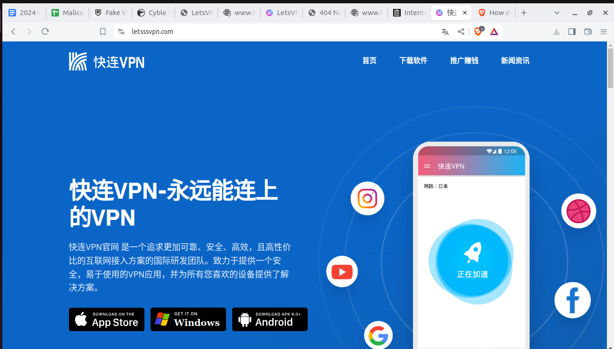

This is a suspicious version of LetsVPN. The download claims to be an APK, but unzipping the files
a Microsoft `MSI` file.

#### Possible Threat actor

void archane: https://thehackernews.com/2024/06/void-arachne-uses-deepfakes-and-ai-to.html

#### Misc. Info

url,letsssvpn.com domain info,

### Candidate3

Requesting the URL `lettsvpn.com` yields the following website:

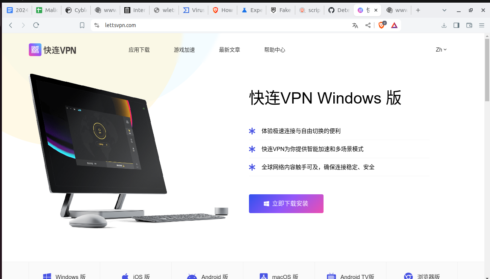

This is another suspicious version of LetsVPN. The download claims to be an APK, but unzipping the files
a Microsoft `MSI` file. This is a different MSI file from `Candidate2`.

### Candidate4

Requesting the URL `letesvpn.com` yields the following page:

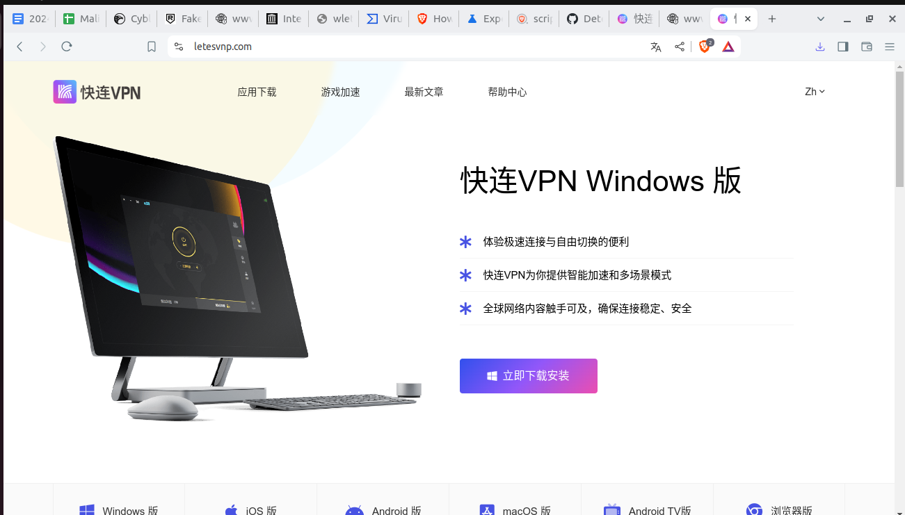

This is another suspicious version of LetsVPN. The download claims to be an APK, but unzipping the files
a Microsoft `MSI` file. This is a different MSI file from `Candidate2`.

### Candidate5

[//]: # vpn type, v2ray, password, 123456, fine location, true

The following candidate is related to the [following report](https://research.checkpoint.com/2023/pandas-with-a-soul-chinese-espionage-attacks-against-southeast-asian-government-entities/)

#### Target Platform

##### Windows

This website provides targets multiple platforms (Android, Windows, and Apple). The Windows EXE files trigger VirusTotal. 

##### Android

The APK uses v2ray for proxy connections. The v2ray configuration files allow both outbound and inbound proxy connections. Outbound connections are expected behavior for VPNss and proxy programs. The configuration file uses the password `123456` and because the key 
is hard coded, an attacker could reverse engineer this binary and eavesdrop on proxied connections. It is anomolous that a proxy application with this design is configured to permit inbound proxy connections. This could indicate that an attacker could conscript infected
devices into a network of some kind, either to proxy other peoples traffic, or some other reason.

I have asked the v2ray community on thissues for additional information and am awaiting a response.

Finally, the APK is configured to route specific domains and App traffic through the proxies. 

##### Apple

The DMG is also 

### Candidate6

Searching for the URL `letsvpn.me` yields a valid website:

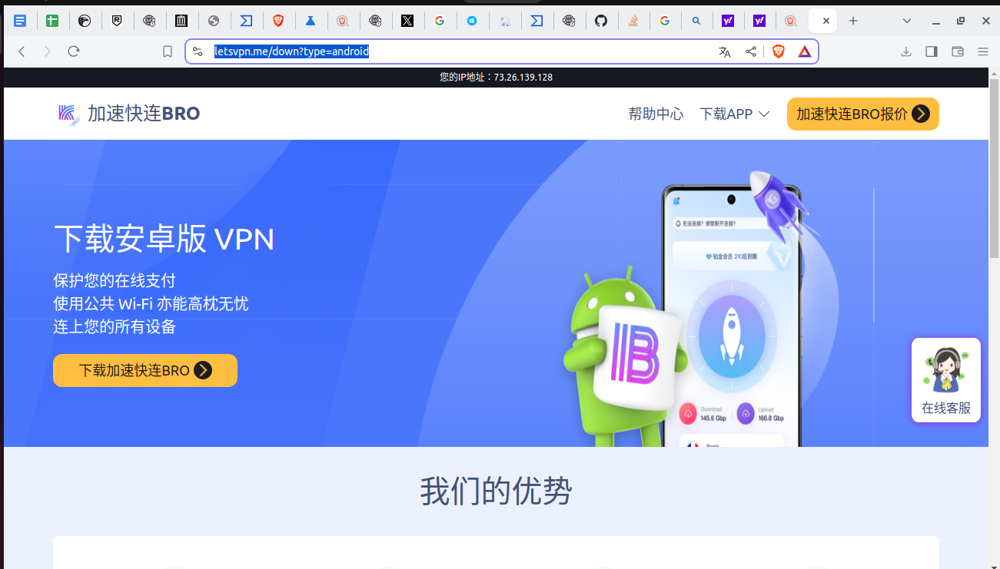

The actual APK name is `com.li.fast`. This decompliled APK is obfuscated as seen in the following image:

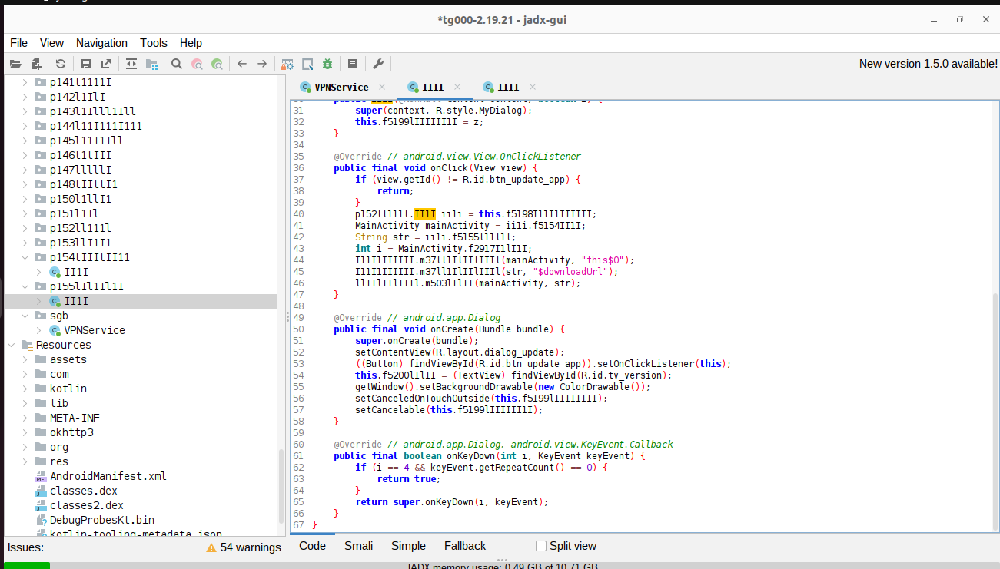

It appears to request minimal permissions, none of which seem too invasive. 

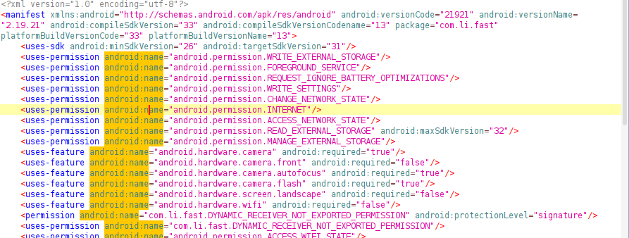

The code reference multiple URLs related to API calls, one `https://gitee.com/tima123/tg0`.

### Candidate7

Searching Baidu for LetsVPN yields the following search results:

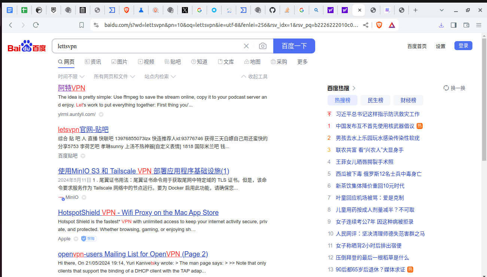

The file downloaded is `pg457.apk`.

After decompiling the code in jadx, the real package name is `com.pangu.c96b73589`

There are some interesting Permissions, such as requesting to download packages and record audio.

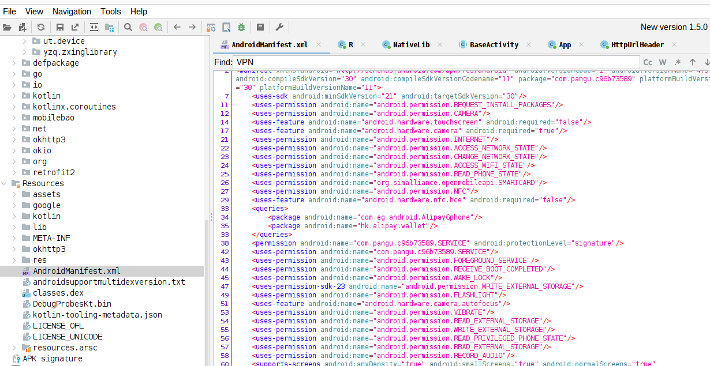

### Candidate8

Baidu also recommended the following site for LetsVPN, `kuailiavfpns.com`.

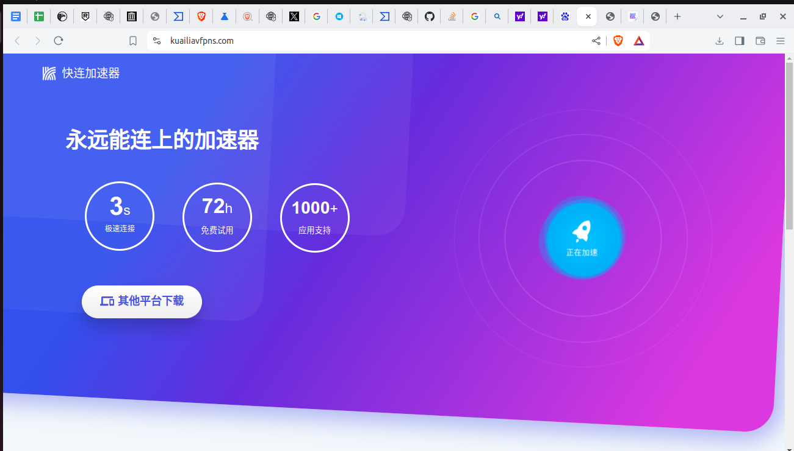

The download produces the zip file, `kuaiVPN.zip`. Unzipping the file yields `kuaiVPN.exe`, which is suspicious because
the download should be for an Android APK. It has sha256 `ee5f3eca5753a7b5f8411c3495662807909618739231a0dad2be365c084ea0a9`.
VirusTotal had 24 of 73 sensors return positive results.

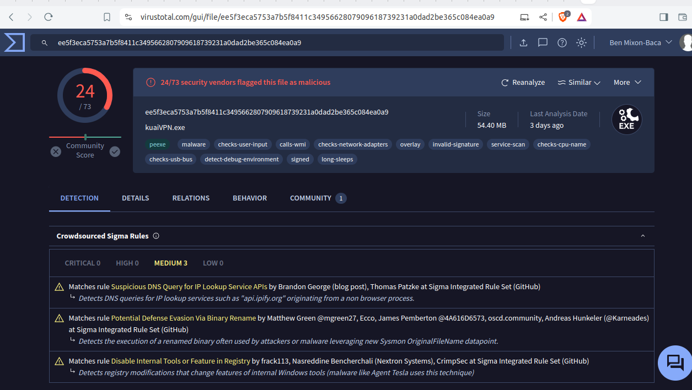

### Candidate9

The following candidate yields another ZIP file containing a Microsoft MSI file, `KuaiVpn-n.msi`.
