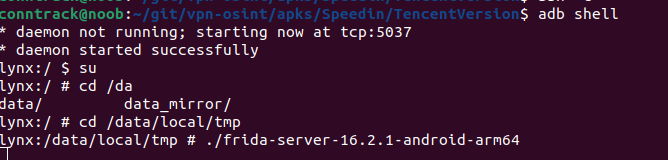
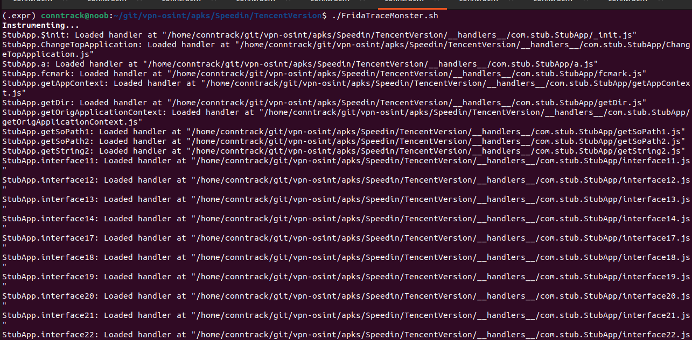
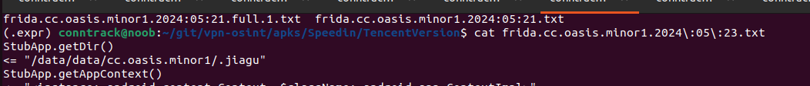

# Unpacking a Packed, Backdoored VPN App

Today I am reverse engineering an APK file I found using an automated tool called CryptoSluice[link].
This app is interesting for a number of reasons. First, it is an Accelerator (VPN) application marketed at Chinese users for its ability to accelerate connections to mainland China when they are over seas. Second, there are multiple version of it that can be downloaded from the Google play store, the Apps website, or the Tencent App Manager. I stumbled onto this packed APK accidently while reversing other
apps and coincidentally downloaded Kuaifan (Speedin VPN) from the Tencent App Manager because why wouldn't I?
I initally downlaoded versions of it both from its website (which might also be compromised via domain squanting, but that's a different story..)., and from Google play. Thinking nothing of it, I assumed when analyzing the APK in jadx that I would have the same APK - it was not

When I loaded the packed version into JADX, I was greeted with very little in the way of Java code from the JADX decompiler. I immediately noticed there is a simple program called `StubApp`. Anyone familiar with reverse engineer while immediately become suspecious because Stub is a term often used to refer to a portion of a packed file that is used to build the actual application (MALWARE).


Upon inspecting the functions names, two things are apparent. First, the function names are obfuscated. Second, they are all `native` functions, meaning that the code is implemented in a `.so` file somewhere.  


Digging into the contents of the APK archive, specifically, in the `lib` directory, there are multiple files, but none of them are apparently the actual app, so we have hit a dead end.


## Where is the APP?

Turning our attention back to the JADX interface, we find a reference to a shared object `jiagu.so`. A quick Search of the different search engines and Github yields results suggesting this `jiagu` is a packer, possibly from Qihoo360, a Chinese computer security company. Comparing this with the code under `lib`, we confirm the file is non-existant. Another dead end. We turn our attention to Frida to find out where this `libjiagu.so` file is. We run the following command:

```bash
#!/bin/bash

APK=cc.oasis.minor1

frida-trace -U -f $APK --decorate -I "libjiagu_64.so" -I "*jiagu*"  -j "cc.oasis.minor1*!*" -j "com.stub.*!*" -j "com.qihoo.util.*!*"  -o frida.$APK.`date +%G:%m:%d`.txt
```





