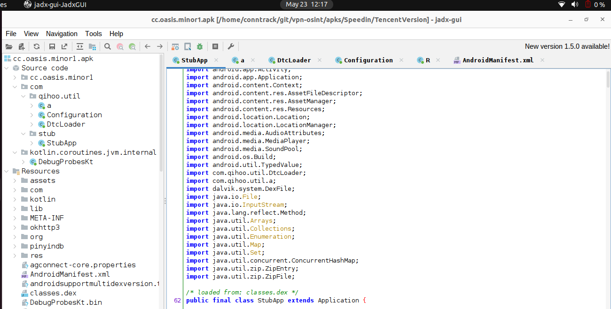
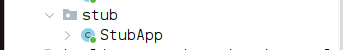
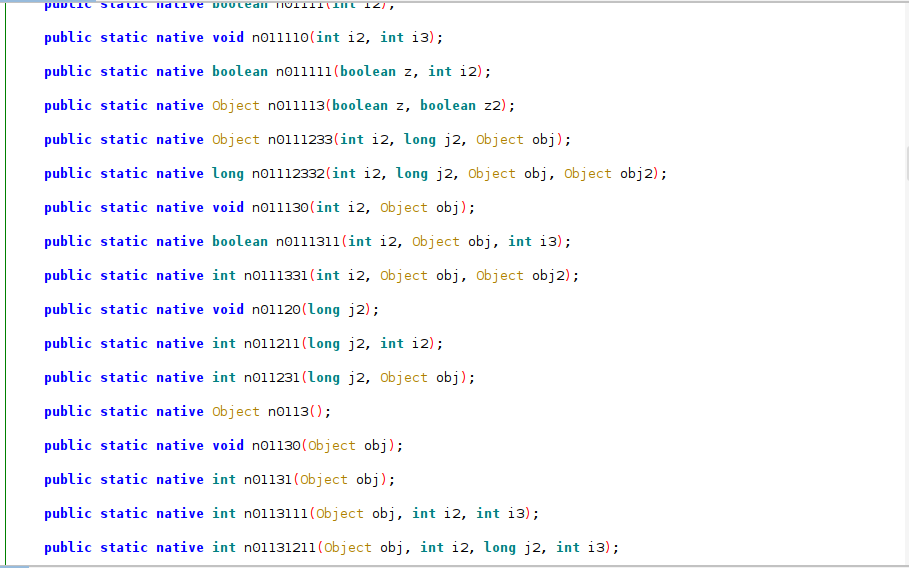
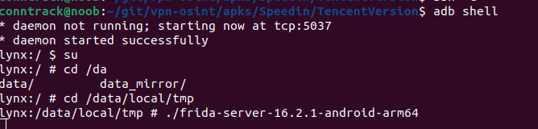
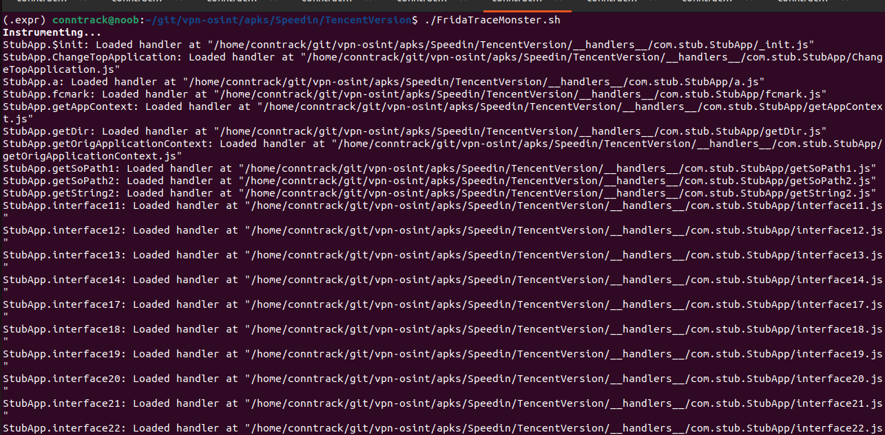
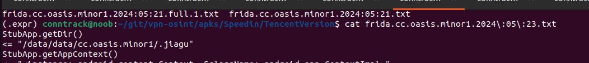
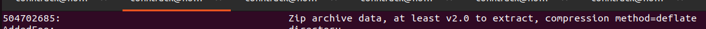
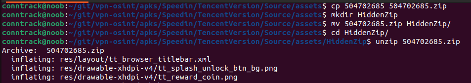
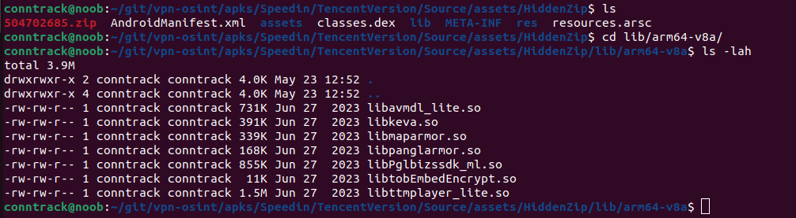

# Unpacking a Packed VPN App

Today I am reverse engineering an APK file identified using CryptoSluice[link].
This app is interesting for a number of reasons. First, it is an Accelerator (VPN) application marketed at Chinese users for its ability to accelerate connections to mainland China when they are over seas. Second, there are multiple version of it that can be downloaded from the Google play store, the Apps website, a third-party website, the Tencent App Manager, and the Huawei app store. I downlaoded versions of it both from its website, a third-party website, Google play, and the Tencent App store. 

Interestingly, the only version that was different from the others was the one downloaded from the Tencent app store. This version of the app was packed and heavily obfuscated. When I loaded the packed version into JADX, I was greeted with very little Java code from the JADX decompiler. The notable piece of code is the `StubApp`, which appears to be a loader. There are a number legitimate and illegimate reasons to pack a piece of software, such as protecting proprietary information. In the case of VPNs though, the security provided by packers provide less transparency to potential users.




Two things are apparent from the function names. First, the function names are obfuscated. Second, they are all `native` functions, meaning that the code is implemented in a `.so` file somewhere.  



Digging into the contents of the APK archive, specifically, in the `lib` directory, there are multiple files, but none of them are apparently the actual app, so we have hit a dead end.

## Where is the APP?

Turning our attention back to the JADX interface, we find a reference to a shared object `jiagu.so`. A quick Search of Google, Baidu, Leo, DuckDuckGo and Github yields results suggesting this `jiagu` is a packer, possibly from Qihoo360, a Chinese computer security company. Comparing this with the code under `lib`, we confirm the file is non-existant. We turn our attention to Frida to find out where this `libjiagu.so` file is. We run the following command:

```bash
#!/bin/bash

APK=cc.oasis.minor1

frida-trace -U -f $APK --decorate -I "libjiagu_64.so" -I "*jiagu*"  -j "cc.oasis.minor1*!*" -j "com.stub.*!*" -j "com.qihoo.util.*!*"  -o frida.$APK.`date +%G:%m:%d`.txt
```





There is a reference to a hidden directory with the same name in the Frida output. The fact that the directory is hidden and the `.so` files are in a hidden directory is only making it more concerning that this is a naughty file, but let's not jump to conclusions. After all, there are plenty of legitimate reasons why a developer/company would pack their APK, particularly if their IP (intellecutal property) is in the app, so we press on.



After pulling the .so file from the phone (using `adb pull` of course :}), we load it into Ghidra.

We see immediately based on the entropy measures that this `so` file is odd. Unfortuntaely, it is become clear that
this program is likely just the unpacker for the actual app, so we dig around the APK more.

# More Obfuscated Files

Next, we find yet more weirdness. After digging into the `assets` directory, we see the file A



We make a copy of this hidden zip, move it to a different location, and unzip it.





And now we have found yet MORE shared objects...


