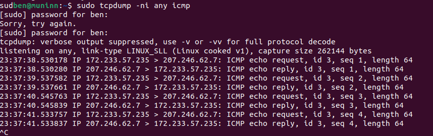
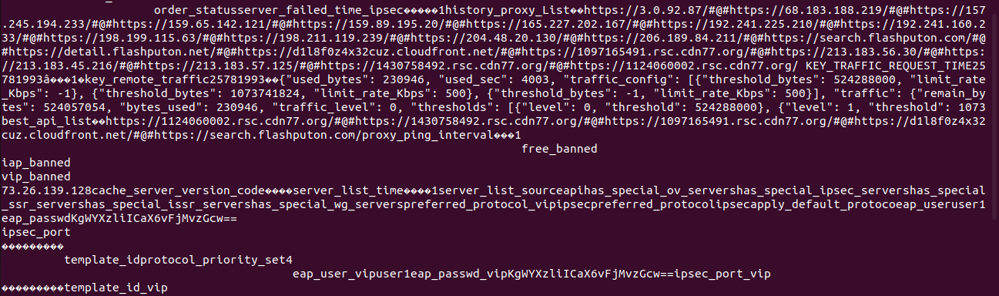

# Reverse Engineering VPN Monster - Basic Dynamic Analysis: Part #1

Author: Ben Mixon-Baca

Date: 2024/5/3

## Dynamic Analysis

The first step I took for for dynamic analysis is testing the free version.
The free version is ad supported and the ads are incredibly long, probably
to motivate the person who downloads the app to get the ``VIP'' version.

### Free Browser

The ap has a built-in browser that is supposed to be secure. I tested a few websites
I thought a malicious app would target.

1. citibank
2. bank of america

Next, I tested baidu, since it is a chinese search engine and this app appears to
be programmed by Chinese devs.

### Ping Test

I sent pings to a server I control just to see if the traffic, at least for ICMP, 
are actually routed through the tunnel. It appears they are. The image below demonstrates
that was successful:

## Files

The app stores a lot of data using the MMKV library from Tencent to keep cached information synchronized. An example is provided in the screen capture and the raw data for one of the files, `mmkv_vpn` is available at, `data/files/mmkv`

## Emails
kuangcheng@inconnecting.com
